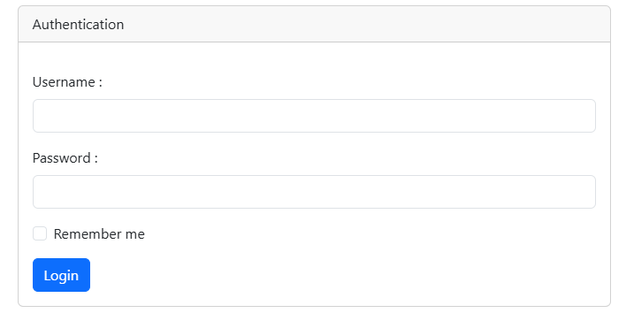
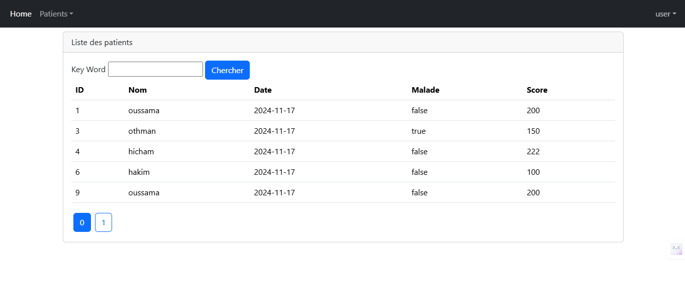
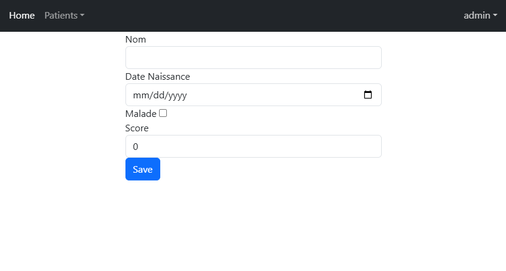
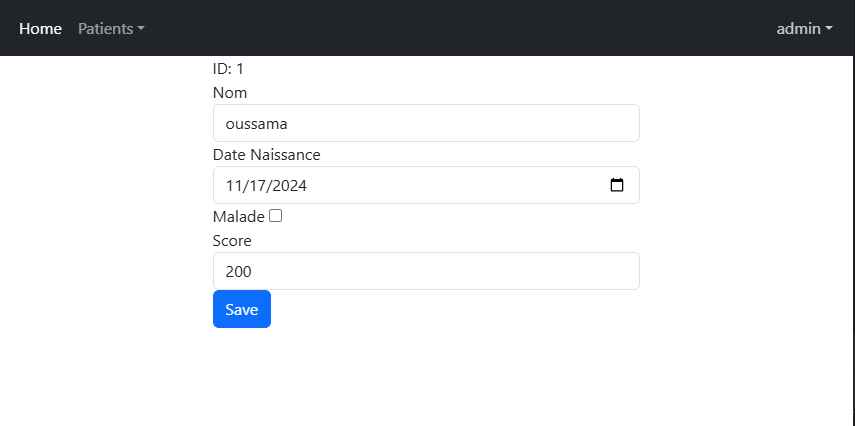
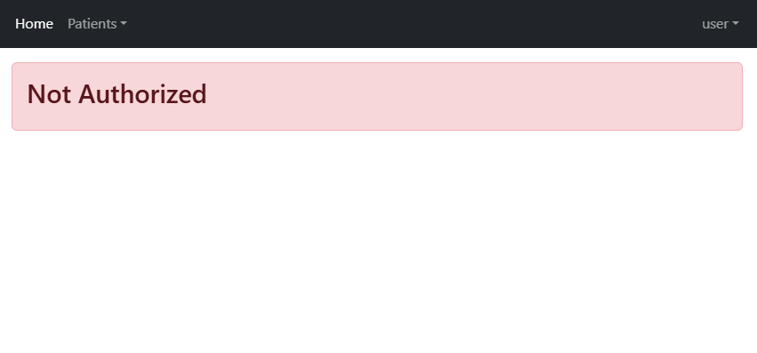

<<<<<<< HEAD

# Spring MVC Patient Management System

This is a Spring Boot MVC project that demonstrates CRUD operations, authentication, and authorization using Spring Security. The project manages patient records with features such as adding, editing, deleting, and listing patients.

## Features

- **CRUD Operations**: Create, Read, Update, Delete patients.
- **Authentication & Authorization**: Implemented using Spring Security with in-memory authentication.
- **Pagination & Search**: List patients with pagination and search functionality.
- **Form Validation**: Validates patient input using Jakarta Bean Validation (e.g., `@NotEmpty`, `@DecimalMin`, etc.).
- **Thymeleaf Templates**: Used for rendering server-side HTML views.
- **Database Integration**: Uses MySQL for persistent data storage.

## Technologies Used

- **Java**: Version 21
- **Spring Boot**: Version 3.3.5
- **Spring Data JPA**: For database operations.
- **Spring Security**: For authentication and authorization.
- **Thymeleaf**: For server-side rendering.
- **Bootstrap 5**: For responsive UI.
- **MySQL**: As the database.
- **Lombok**: For reducing boilerplate code.

## Prerequisites

- Java JDK 21 or higher
- Maven
- MySQL Server
- Git

## Setup Instructions

1. **Clone the Repository**:

   ```bash
   git clone https://github.com/yourusername/spring-mvc-patient-management.git
   cd spring-mvc-patient-management
   ```

2. **Configure the Database**:

   Update the `application.properties` file with your MySQL credentials:

   ```properties
   spring.datasource.url=jdbc:mysql://localhost:3306/patient_db
   spring.datasource.username=root
   spring.datasource.password=yourpassword
   spring.jpa.hibernate.ddl-auto=update
   ```

3. **Build the Project**:

   ```bash
   mvn clean install
   ```

4. **Run the Application**:

   ```bash
   mvn spring-boot:run
   ```

   The application will be accessible at `http://localhost:8080`.

5. **Access the Application**:

   - **User**: `user`, Password: `123`
   - **Admin**: `admin`, Password: `admin`

## Project Structure

```plaintext
src/main/java/org/example/springmvc
├── entities/Patient.java
├── repository/PatientRepository.java
├── security/SecurityConfig.java
├── web/PatientController.java
├── web/SecurityController.java
└── SpringMvcApplication.java
```

## Endpoints

- `/user/index`: List patients (accessible by `USER` and `ADMIN` roles).
- `/admin/formPatients`: Add a new patient (accessible by `ADMIN` role).
- `/admin/editPatient`: Edit a patient (accessible by `ADMIN` role).
- `/admin/delete`: Delete a patient (accessible by `ADMIN` role).
- `/login`: Login page.
- `/notAuthorized`: Access denied page.

## Screenshots

- **Login Page**

- **Patient List**

- **Add/Edit Patient Form**


- **Access Denied Page**


## License

This project is open-source and available under the [MIT License](LICENSE).
=======
# Secure_SpringMVC_JDBC
>>>>>>> 5d5e37ea8dccc64ccaaabb05b64261c55c6f9b6c
